# Press Kit
**Last updated** January 28, 2022

 

## What is Sambot for Bitrise ?

Sambot is a tool **helping you and your team** in your Bitrise Continuous Integration experience, in order to make **easier**, more **powerful** and more **efficient** the use of Bitrise services, even for non-developers... 

Sambot is **designed for all members** of any mobile application product team using Bitrise CI: Developers, DevOps, Q&A, Product Owners/Managers, Designers…

Sambot is **developed for its users**, to be more efficient on what they really have (& love) to do!

 

<iframe src="https://player.vimeo.com/video/656315015?h=04b710eb45&amp;badge=0&title=0&byline=0&portrait=0&amp;autopause=0&amp;player_id=0&amp;app_id=58479" frameborder="0" allow="autoplay; fullscreen; picture-in-picture" allowfullscreen style="position:absolute;top:0;left:0;width:100%;height:100%;" title="Sambot for Bitrise"></iframe>

 

## Main features

- **Monitor** your most important Projects and **follow their Builds** and health at any time
- Quickly understand **why and where your Build has failed** with Failure Analysis
- Follow builds Steps (live or afterward) parsed from Bitrise log to **instantly identify what’s happening**
- See **all details of any Builds** and restart or abord them in one tap
- **Download** all build artifacts easily
- **Analyze** your projects with **Analytics Insight** where tons of metrics are computed from all their builds: Cost, Duration, Success/Failure rates, Waiting time, Number of builds... These metrics are presented in beautiful colored charts, grids or highlights
- Add favorite Artifacts on Dashboard and **automatically get instant access to their last version**
- Run (and Re-Run)  at a glance your **recurrent Workflows** on any combination of projects, branches, or tags
- Be notified by **push notifications** as soon as a Build finished to act in the nick of time
- Find the build you are looking for with a **powerful search engine** to inspect, rerun or abort it instantly
- Launch your favorites Workflows / Builds with **Shortcut & Siri**
- See **Projects Statistics** (success, failure & average duration) and Projects **Trends** through a nice weather forecast representation
- Get a comprehensive & understandable **Test Report summary** for your builds, parsed from CI logs
- Save Build configuration for **quick Redo later**
- **Synchronize** all your favorite Projects, Workflows, and custom environment parameters across all your devices with iCloud sync
- Have an **intuitive Onboarding** and easy access to the most useful features
- Build logs from Bitrise are **parsed and colorized** with themes

## Remarks
- All private information is encrypted and protected from the outside world
- Sambot app is **100% SwiftUI**, built with [The Composable Architecture](https://github.com/pointfreeco/swift-composable-architecture) and its backend is written in Swift ([VAPOR](https://vapor.codes))

 

## General Informations

| Website | [sambot.app](https://www.sambot.app) |
| :--- |---:| 
| Company | Jay & Jay |
| Developers | &emsp;&emsp;&emsp;&emsp; Jeffrey Macko & Jérémie Godon |
| Contact | [contact@sambot.app](mailto:contact@sambot.app) |
| Twitter | [@sambot_app](https://www.twitter.com/sambot_app) |
| App Store link| [apps.apple.com](https://apps.apple.com/app/apple-store/id1584776704?pt=123480917&ct=www&mt=8) |

 

## Screenshots

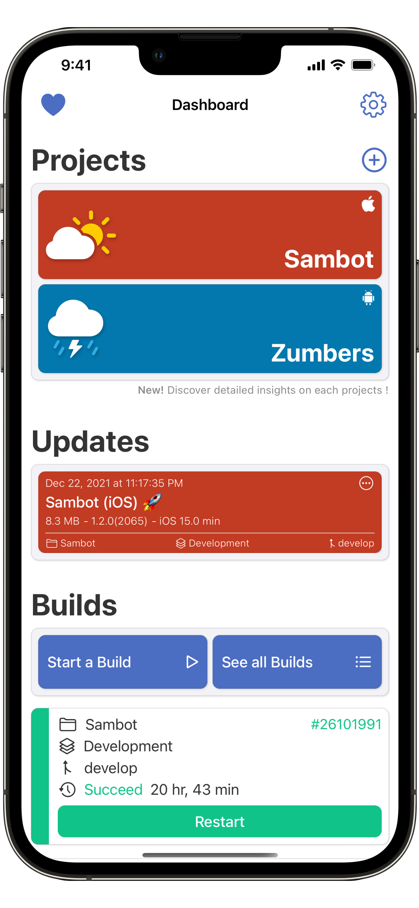 &emsp;&emsp; 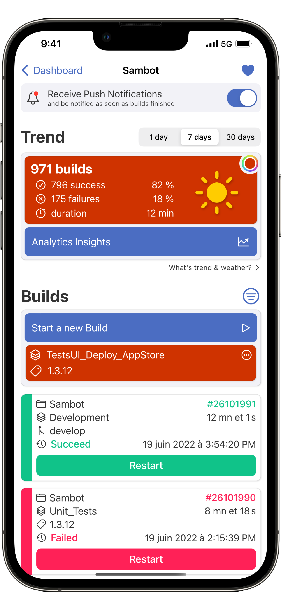
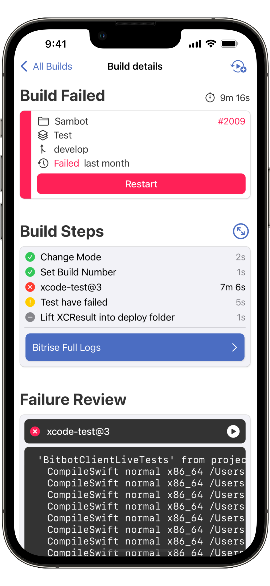 &emsp;&emsp; 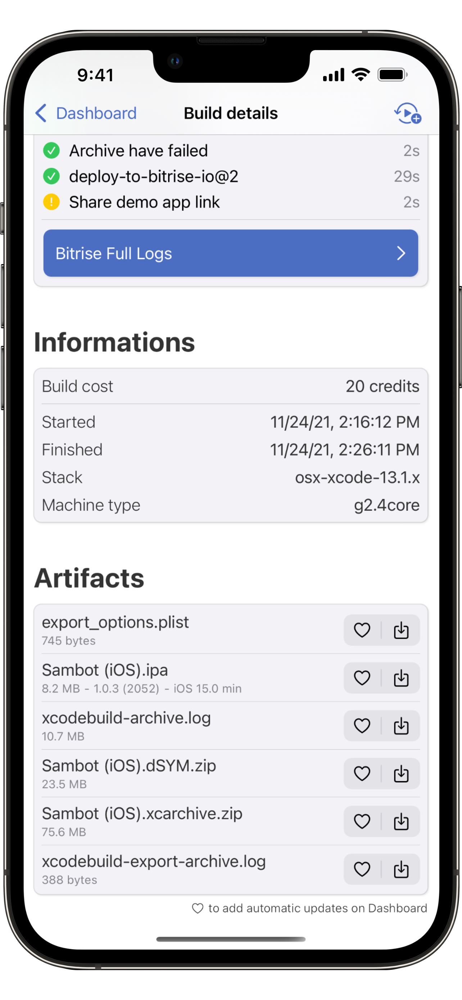
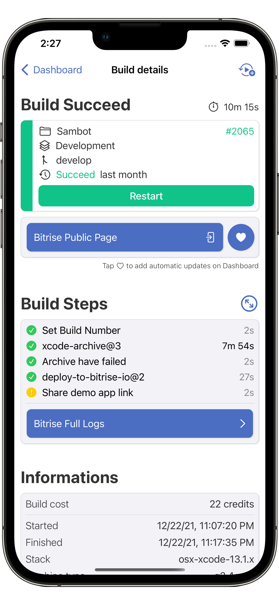 &emsp;&emsp; 
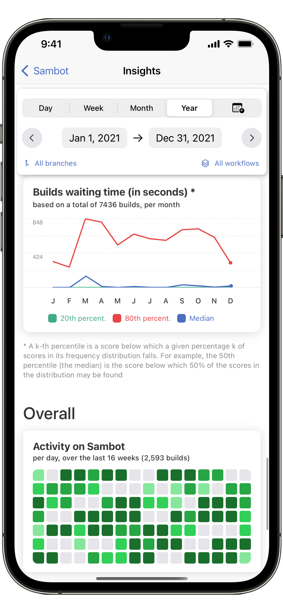 &emsp;&emsp; 
 &emsp;&emsp; 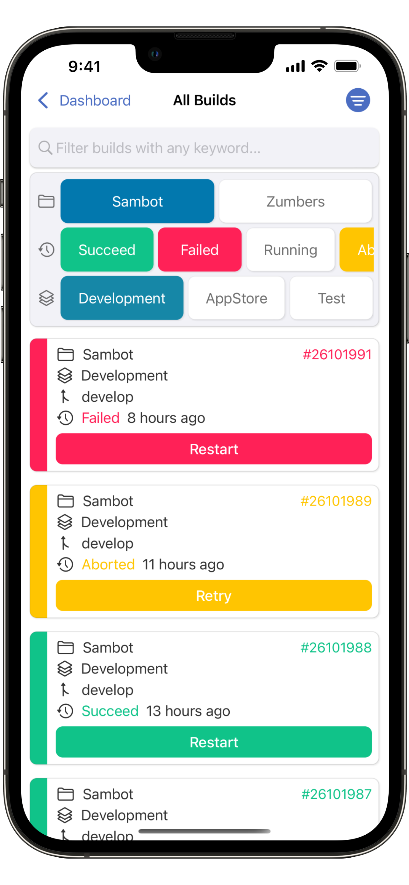
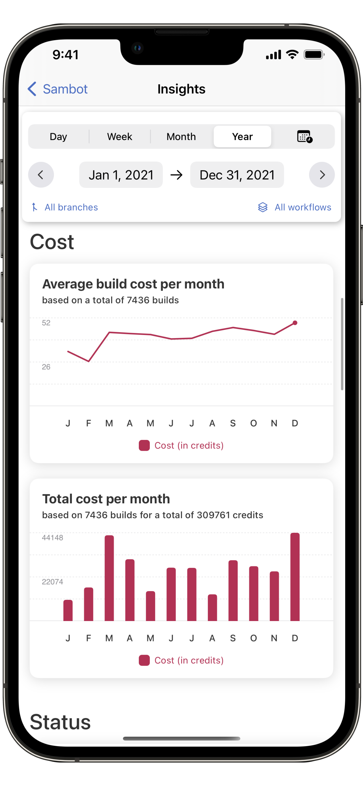 &emsp;&emsp; 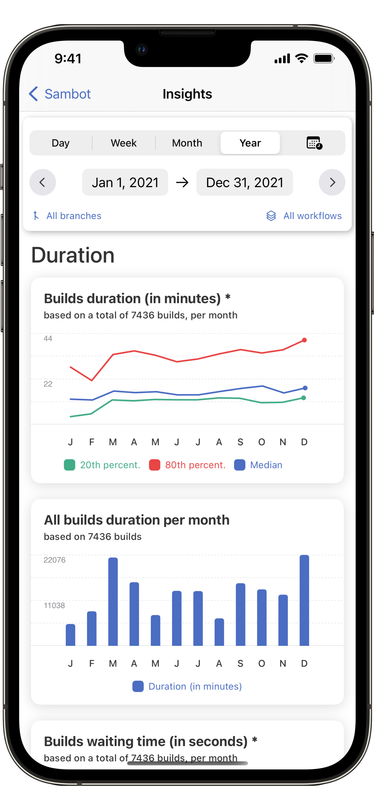
 &emsp;&emsp; 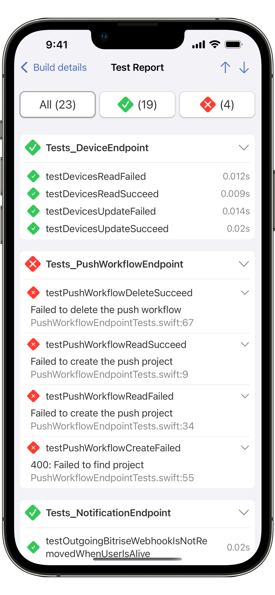
 &emsp;&emsp; 

> You'll find all these screenshots in their original size [in this zip file](../assets/Screenshots.zip)

 

## Logo

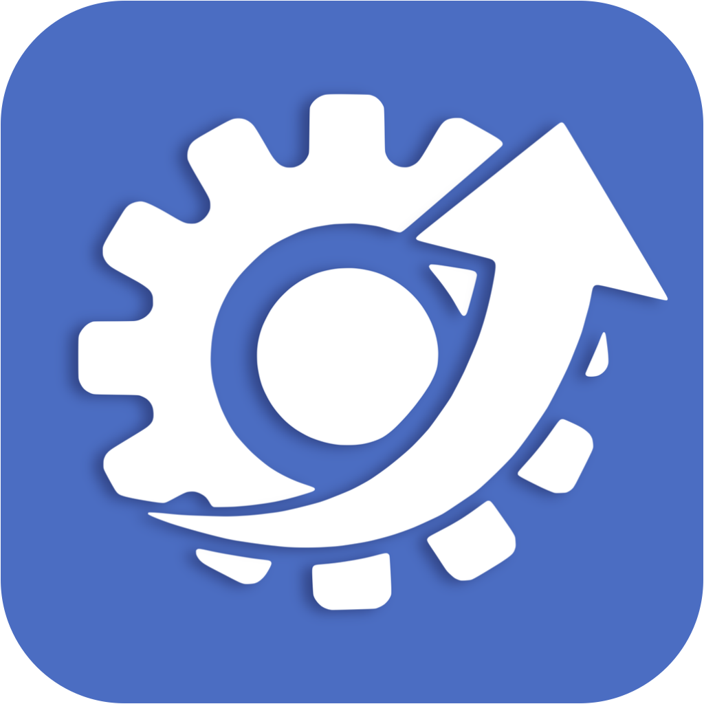

 

## Supported platforms
- iOS
- iPadOS