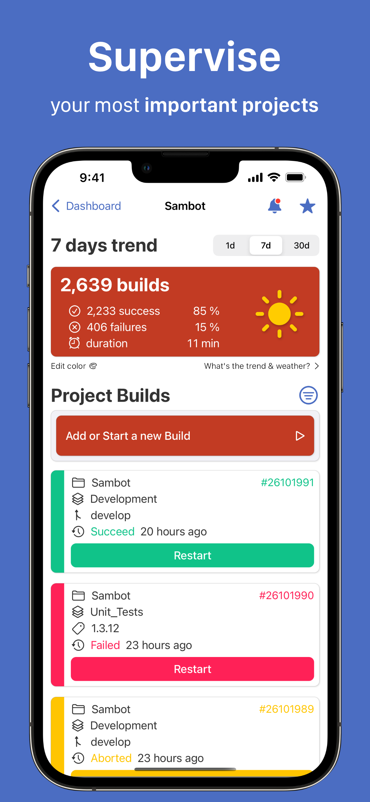
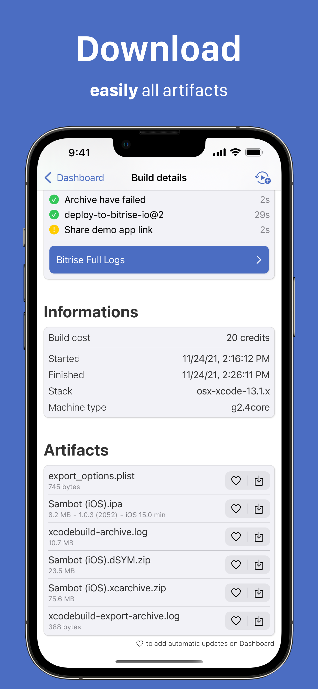
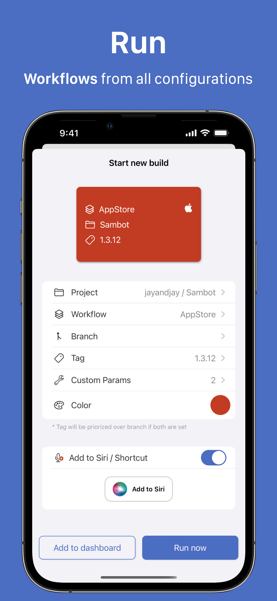
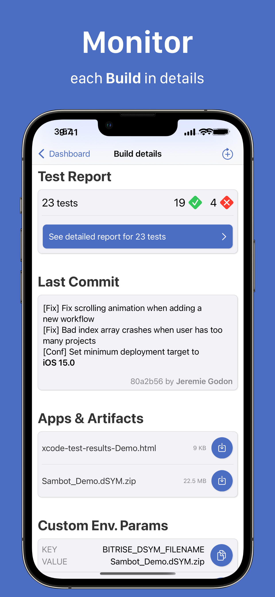
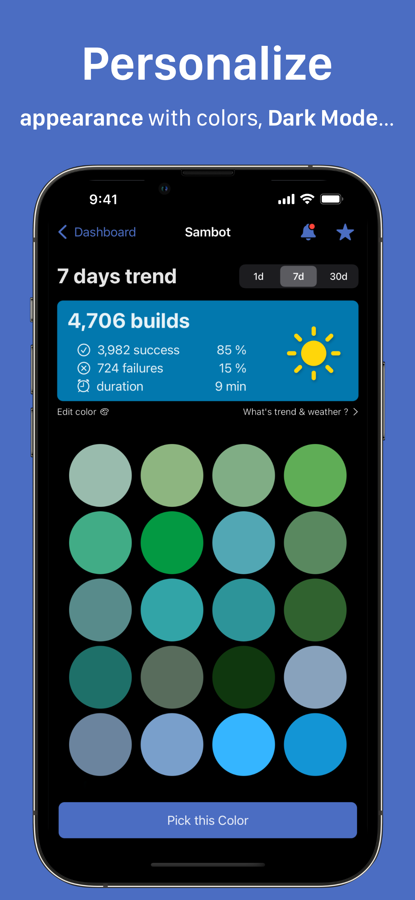

# Press Kit
**Last updated** November 2, 2021

## What is Sambot app ?
Sambot application is a tool helping you in your Bitrise `Continuous Integration` experience, to be more efficient on what you love to do! 

Its main features are :

- Have Quick Access to your most important Projects and follow their Builds and Health at any time
- Be notified as soon as a Build finished (success or error) to act in the nick of time
- Add, Run and Rerun recurrent Workflows (on any combination of projects, branches, or tags) at a glance
- See all details of any Builds and restart or abord them in one tap
- Download all build artifacts easily
- Quickly understand why and where your Build has failed with Error Analysis
- Follow builds Steps (live or afterward) parsed from Bitrise log to instantly identify what's happening
- Find the build you are looking for with a powerful search engine to inspect, rerun or abort it instantly
- Launch your favorites Workflows / Builds with Shortcut & Siri 
- See projects Statistics (success, failure & average duration) and projects Trends through a nice weather forecast representation
- Get a comprehensive & understandable Test Report summary for your builds, parsed from CI logs
- Save Build configuration for Quick Redo later
- Synchronize all your favorite Projects, Workflows, and custom environment parameters across all your devices with iCloud sync
- Have an intuitive Onboarding and easy access to the most useful features
- Build logs from Bitrise are parsed and colorized with themes
- All private information is encrypted and protected from the outside world
- Sambot app is 100% SwiftUI, built with The Composable Architecture and its backend is written in Swift

## General Informations

| Website | [sambot.app](https://www.sambot.app) |
| :--- |---:| 
| Company | Jay & Jay |
| Developers | Jeffrey Macko & Jérémie Godon |
| Contact | [contact@sambot.app](mailto:contact@sambot.app) |
| Twitter | [@sambot_app](https://www.twitter.com/sambot_app) |
| App Store link| [apps.apple.com](https://apps.apple.com/fr/app/sambot-for-bitrise/id1584776704) |

## Screenshots

 
 
 
 
 

> You'll find all these screenshots in their original size [in this zip file](../assets/Screenshots.zip)

## Logo

## Supported platforms
- iOS
- iPadOS