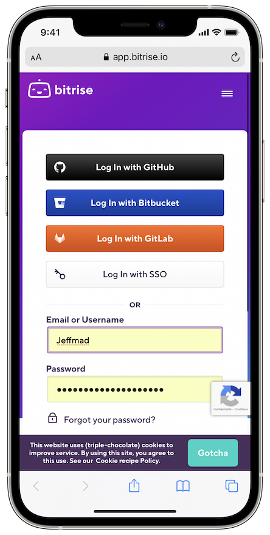
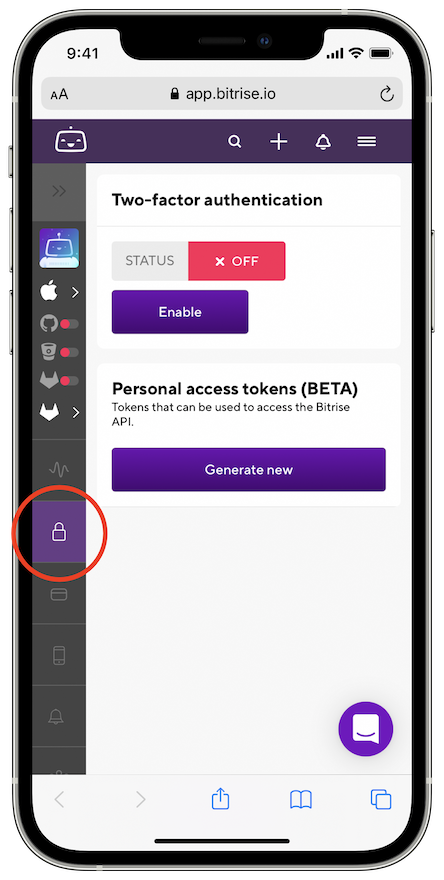

# How to generate a Bitrise token?

Generate a Bitrise token and adding it to Sambot is quick and easy !

Be sure to have a Bitrise account access (visit [www.bitrise.io](https://www.bitrise.io) if not) and just follow these 5 steps...

## Step 1 - Go to [Bitrise website](https://app.bitrise.io/me/profile#/security)

## Step 2 - Log in to your Bitrise account and go to the security settings

 

 

## Step 3 - Generate a token 
(ideally with no expiration date but this is not mandatory)

 

## Step 4 - Copy this token to your clipboard before closing the website

 

## Step 5 - Tap to paste it in Sambot app token Textfield

and that's it!

